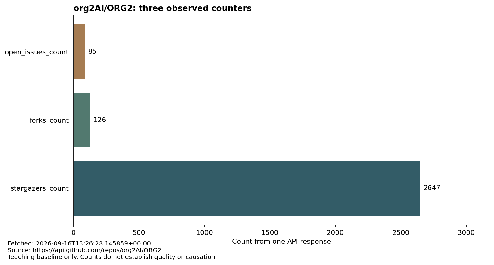

# 文字、图表与原始数据核对

这份资料用于练习核对同一事实的不同表达方式，不是学生本次作业的请求结果。

## 阅读顺序

1. 阅读 [API 数据说明](API数据说明.md)，先说明你要验证什么。
2. 打开下图，描述实际看见的标题、三个字段及数值。不能打开图片时明确说明，不把读取 CSV 称为看过图片。
3. 用 [CSV 表格](baseline/counters.csv) 和 [原始 JSON](baseline/response.json) 核对图中数字。
4. 查看 [来源与采集时间](baseline/provenance.json)，区分教师采集时间与学生本次请求时间。

图表将 `stargazers_count`、`forks_count`、`open_issues_count` 的值画为横向条形图。横轴是原始计数。三个字段衡量的对象不同，不能相加后当作项目质量分数。

## 需要保留的判断

- 图片、CSV 和 JSON 的数值是否一致？依据具体字段回答。
- “某个计数更高，所以代码质量更好”是否得到这些数据支持？缺少什么证据？
- 学生重新请求后数字发生变化，是否一定代表错误？先比较请求时间、仓库和字段。
- 图片读取失败、API 请求失败或内容不可验证时，保留实际限制，不补写不存在的成功结果。

## 复现教师资料

使用 Python 3 和 Matplotlib 运行 `python tools/refresh_materials.py`。脚本真实请求公开 API，更新 JSON、来源记录、CSV 和 PNG；更新后必须提交新版本。网络失败时脚本报错，不能把旧资料说成刚获取的数据。

学生应将自己的真实请求与验证文件保存在个人成果目录，不修改教师基线来匹配自己的结果。
